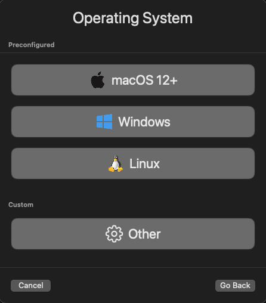
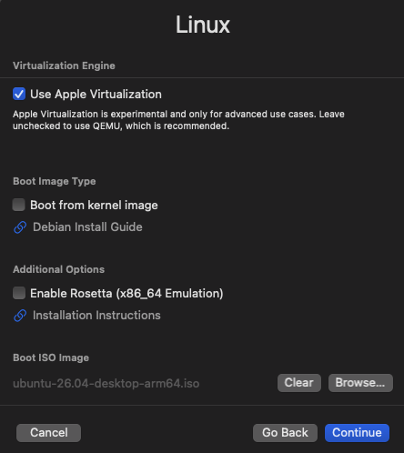
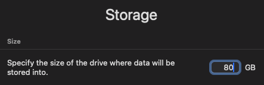
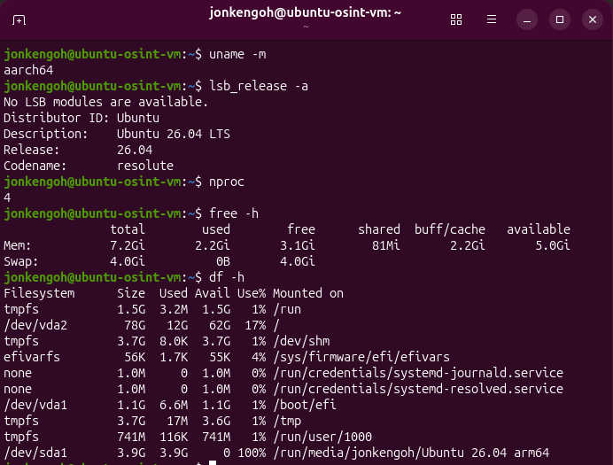
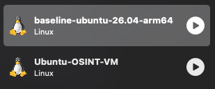

# VM Setup

## 0. Download Ubuntu 26.04 LTS

Download Ubuntu from https://ubuntu.com/download/desktop:

Select ARM 64-bit Architecture for ARM-based hardware.

You should see the download confirmation:


## 1. Create the Virtual Machine

Open UTM and select **Create a New Virtual Machine**.


Select **Virtualize** rather than Emulate.


---

## 2. Select the Operating System

Select **Linux** from the list:



Provide the Ubuntu ARM64 installation image and select Apple Virtualization:




---

## 3. Configure VM Resources

Configure the VM with:

| Resource | Configuration |
|---|---|
| CPU | 4 cores |
| Memory | 8 GB |
| Storage | 80 GB |


Continue through the remaining UTM configuration screens using the default settings. **Do not configure file sharing/shared directories** at this stage.

---

## 4. Configure Networking

Use shared/NAT networking for the initial environment.




## 5. Install Ubuntu

Start the VM and proceed through the Ubuntu installer.

Use the following configuration:

| Setting | Configuration |
|---|---|
| Installation Type | Default / Interactive Installation |
| Third-Party Software | Enabled |
| Disk Encryption | Disabled |
| User Account | Local user |
| Active Directory | Disabled |

> **Note:** Disk encryption is disabled for the baseline environment to simplify VM recovery, backups, and reproducibility. Sensitive investigation data should be handled separately and according to applicable security requirements.

Once the installation is complete, restart the VM and log in.

---

## 6. Verify the Installation

Before installing additional software, verify that the VM is running the expected architecture and Ubuntu version.


### Verify Architecture

Run:

```bash
uname -m
```
The expected output is:

```aarch64```

This confirms that the VM is running the ARM64 architecture natively

### Verify Ubuntu Version

Run:

```bash
lsb_release -a
```

The output should identify Ubuntu 26.04 LTS.


### Verify CPU and Memory

Run:

```bash
nproc
free -h
```

The expected configuration is approximately:

```
CPU:    4 cores
Memory: 8 GB
```

Verify Storage

Run:

```bash
df -h
```

Confirm that the expected virtual disk is available to the guest.



### Verify Network Connectivity

Run:

```bash
ping -c 4 8.8.8.8
```

Successful responses confirm basic network connectivity.

A DNS check can also be performed with:

```bash
ping -c 4 ubuntu.com
```

---

### 7. Create the Baseline Backup

Once the installation and verification steps have completed successfully, shut down the VM cleanly.

Create a **clone** of the verified installation.


Recommended backup name:

```baseline-ubuntu-26.04-arm64```

This backup represents the clean starting point for the remainder of the project.



The backup is intended for convenient rollback. The Git repository remains the source of truth for reproducible configuration.


---