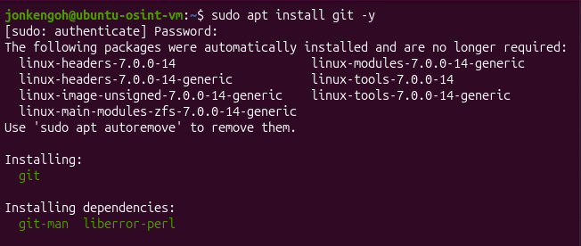
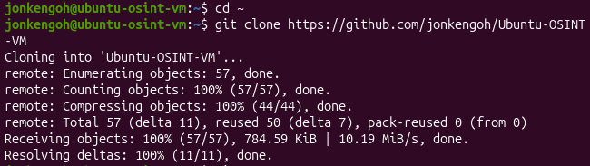
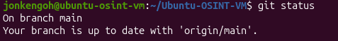

# Setup Git on Linux

Use:

```bash
sudo apt install git -y
```




Check git version using:

```bash
git version 
```


Git clone your repository for this machine using:

```bash
git clone <your repository url>
```




Check status of repository by running:

```bash
cd <your repository folder>

git status 
```

