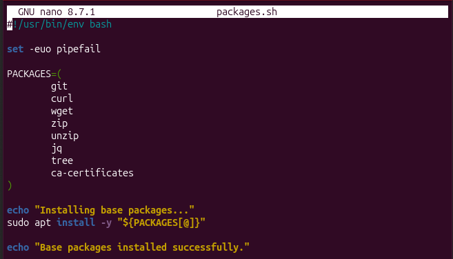
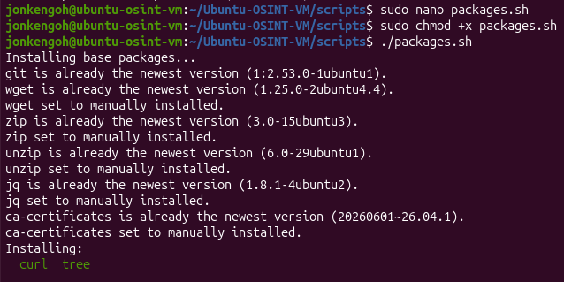
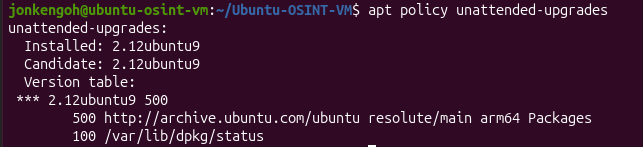
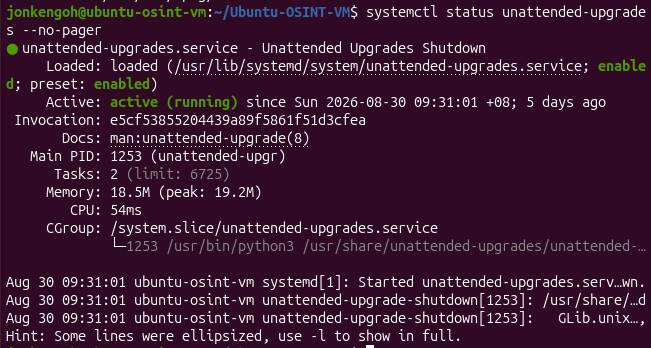
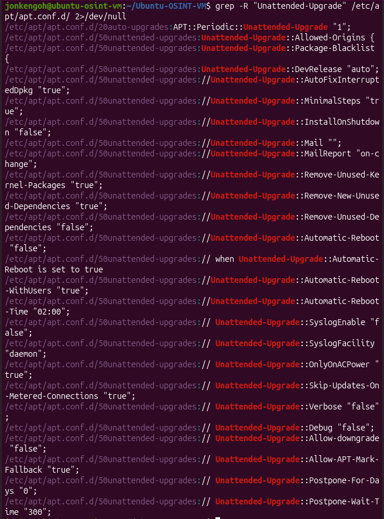
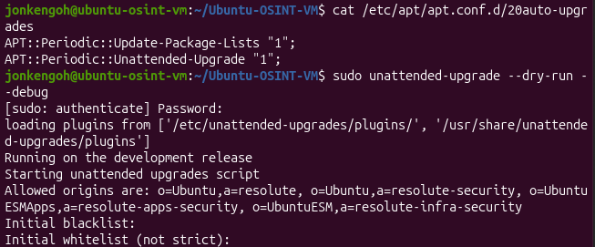
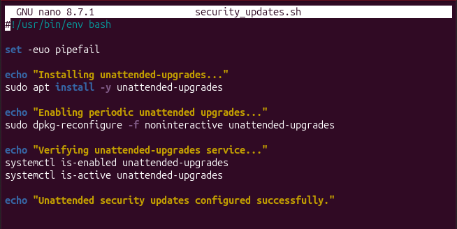
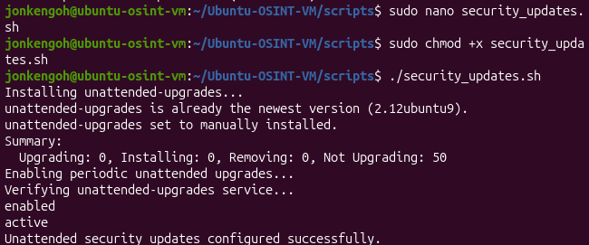

# Package Shell script Setup

Using nano inside scripts directory:

```bash
cd scripts/
sudo nano packages.sh
```

Fill in the following code:




Change permissions and run the shell script:

```bash
chmod +x packages.sh
./packages.sh
```




# Unattended Security Update (USU) Setup 


Check current Ubuntu configurations:

```bash
apt policy unattended-upgrades
```



```bash
systemctl status unattended-upgrades --no-pager
```



```bash
grep -R "Unattended-Upgrade" /etc/apt/apt.conf.d/ 2>/dev/null
```




```bash
cat /etc/apt/apt.conf.d/20auto-upgrades
sudo unattended-upgrade --dry-run --debug
```




## If USU is not configured:

Add this shell script

```bash
cd scripts/
sudo nano security_updates.sh
```



Run the file to configure automatic security updates

```bash
chmod +x security_updates.sh
./security_updates.sh
```


