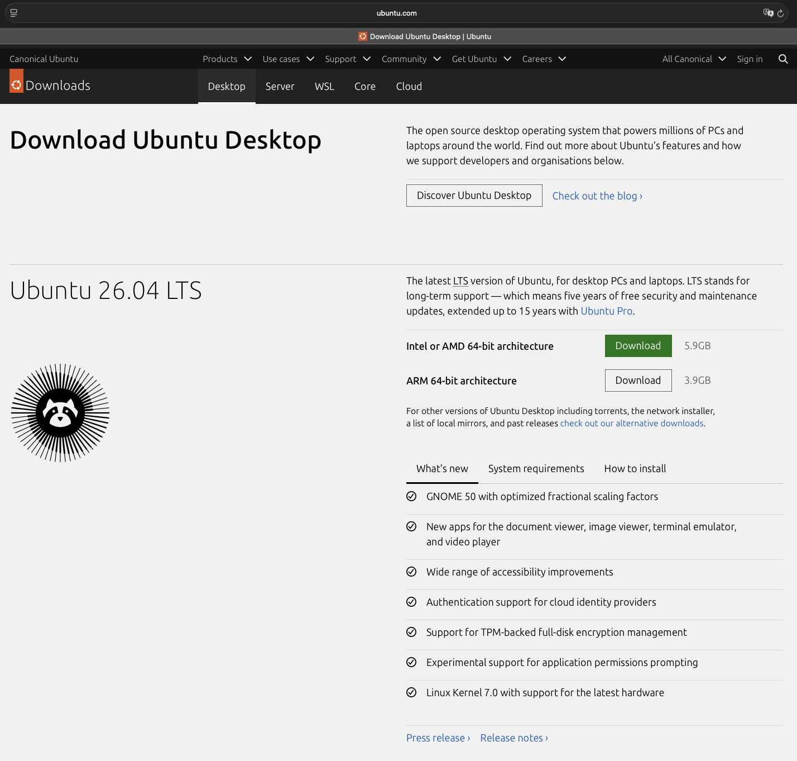
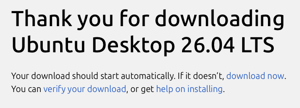
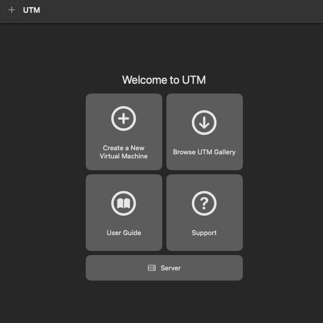
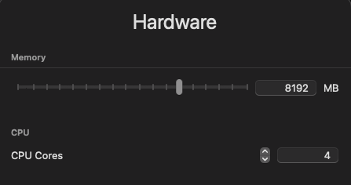
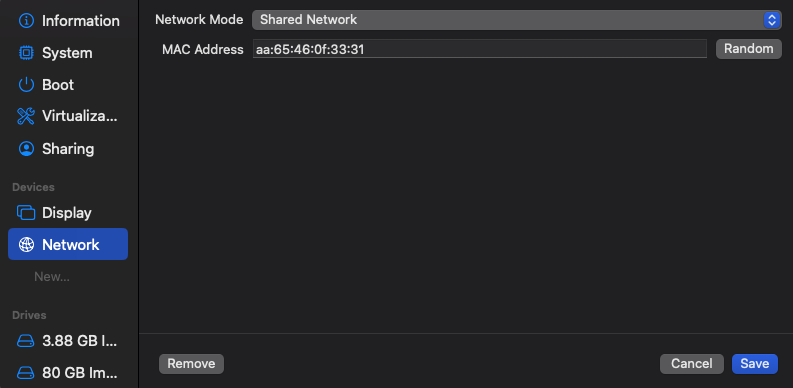

# VM Setup

## 0. Download Ubuntu 26.04 LTS

Download Ubuntu from https://ubuntu.com/download/desktop:

Select ARM 64-bit Architecture for ARM-based hardware.

You should see the download confirmation:

## 1. Create the Virtual Machine

Open UTM and select **Create a New Virtual Machine**.

Select **Virtualize** rather than Emulate.

---

## 2. Select the Operating System

Select **Linux** from the list:

Provide the Ubuntu ARM64 installation image and select Apple Virtualization:

---

## 3. Configure VM Resources

Configure the VM with:

| Resource | Configuration |
|---|---|
| CPU | 4 cores |
| Memory | 8 GB |
| Storage | 80 GB |

Press next for everything; *skip* **file sharing/shared directory** for now.

---

## 4. Configure Networking

Use shared/NAT networking for the initial environment.

